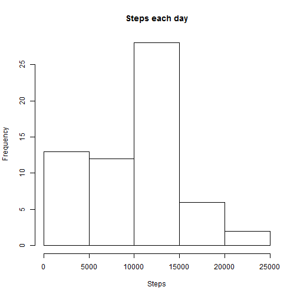
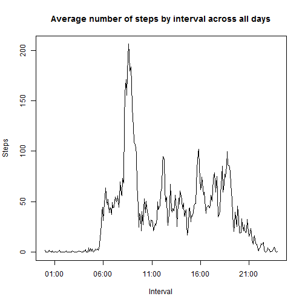
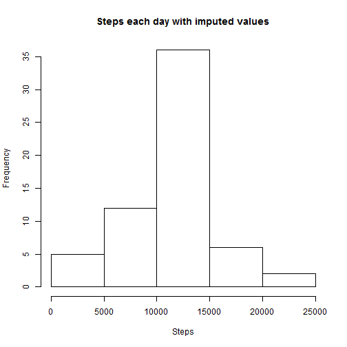
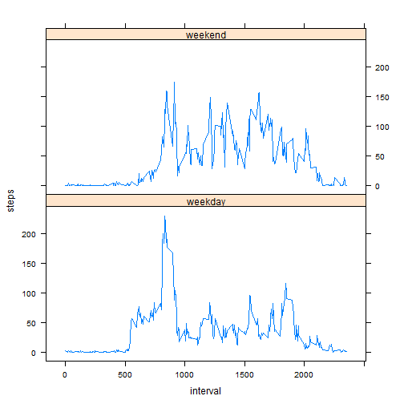

I assume that the file has been downloaded and unzipped into working directory.
So we start with reading it.


```r
rawdata <- read.csv("activity.csv", sep = ",", header = TRUE)
```
###What is mean total number of steps taken per day?

tapply function is used to group sums of steps by days. From then, building histogram and calculating mean and median of steps by day is a matter of single function each.


```r
z <- tapply(rawdata$steps, rawdata$date, sum, na.rm = TRUE)

hist(z, xlab = "Steps", main = "Steps each day")
```

 

```r
mean(z)
```

```
## [1] 9354.23
```

```r
median(z)
```

```
## [1] 10395
```

###What is the average daily activity pattern?


```r
inter <- as.factor(rawdata$interval)
zz <-tapply(rawdata$steps, inter, mean, na.rm = TRUE)
timeints <- as.character(unique(inter))

toadd <- nchar(timeints)<4
while (any(toadd)) {        
        timeints[toadd] <- paste("0", timeints[toadd], sep = "")
        timeints
        toadd <- nchar(timeints)<4
        toadd
        }
timeints <- strptime(timeints, "%H%M")
```


```r
plot(timeints,zz,type="l", ylab="Steps", xlab="Interval", main="Average number of steps by interval across all days")
```

 

**Interval with most steps is**


```r
format(timeints[which(zz == max(zz))], "%H:%M")
```

```
## [1] "08:35"
```

###Imputing missing values


```r
filldata <- rawdata
tofill <-is.na(filldata$steps)
```

Here's the number of missing values:

```r
length(tofill[tofill])
```

```
## [1] 2304
```

**Missing values are extrapolated from the average for the 5-minute interval across all the days.** Step distribution obviously shifted towards the mean.


```r
zz <- tapply(rawdata$steps, inter, mean, na.rm = TRUE)
filldata$steps[tofill] <- zz[as.character(rawdata$interval[tofill])]

z <- tapply(filldata$steps, filldata$date, sum, na.rm = TRUE)

hist(z, xlab = "Steps", main = "Steps each day with imputed values")
```

 

```r
mean(z)
```

```
## [1] 10766.19
```

```r
median(z)
```

```
## [1] 10766.19
```

###Are there differences in activity patterns between weekdays and weekends?

I calculate the average numbers of steps for 5 minute interval, then clumsily reshape the data frame into data frame with averages and plot the panel plot with lattice package.


```r
filldata$iswkd  <- lapply(filldata$date, function(x) {if (weekdays(as.Date(x)) == "Saturday"|weekdays(as.Date(x))=="Sunday") "weekend" else "weekday"})
filldata$iswkd <- as.factor(as.character(filldata$iswkd))

kday <- (filldata$iswkd=="weekday")
kend <- (filldata$iswkd=="weekend")

kdayinter <- as.factor(filldata$interval[kday])
kendinter <- as.factor(filldata$interval[kend])

kdayz <-tapply(filldata$steps[kday], kdayinter, mean, na.rm = TRUE)
kendz <-tapply(rawdata$steps[kend], kendinter, mean, na.rm = TRUE) 


library(lattice)
aframe <- cbind(as.numeric(kdayz),unique(filldata$interval),rep("weekday",length(kdayz)))
bframe <- cbind(as.numeric(kendz),unique(filldata$interval),rep("weekend",length(kendz)))

sumdata <- rbind(aframe,bframe)
sumdata <- data.frame(sumdata)
colnames(sumdata) <- c("steps","interval","iswkd")
sumdata$iswkd <- as.factor(as.character(sumdata$iswkd))
sumdata$interval <- as.numeric(as.character(sumdata$interval))
sumdata$steps <- as.numeric(as.character(sumdata$steps))


xyplot(steps ~ interval |iswkd, data=sumdata, type="l", layout=c(1,2))
```

 
         
